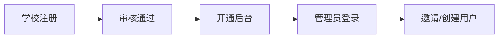

### 项目架构
    线上sass系统,用户数据库分表隔离数据,用户通过不同二级域名识别对应系统.此系统还对应设备管理系统的后台管理系统,用以管理swr公用库数据及学校
    
使用到:
*  thinkphp(onebase)
*  redis
*  bootstrap3
*  vue
*  iview
    
### 开通流程

### 系统角色
名称|级别|
--|:--:|
老师|level1|
实验室管理员|level2|
管理员|level3|
---
#### 老师

    拥有权限
- [x] 我的主页
    - [x] 预约统计
    - [x] 心愿清单统计
- [x] 实验预约
    - [x] 发起预约
    - [x] 预约列表
        - [x] 查看
        - [x] 编辑
        - [x] 删除
- [x] 我的设备
    - [x] 我的设备
        - [x] 添加新设备
        - [x] 设备预约实验
        - [x] 加入心愿单
        - [x] 搜索
        - [x] 编辑
        - [x] 详情
    - [x] swr设备
        - [x] 批量添加设备到我的
        - [x] 加入心愿单
        - [x] 添加到我的
        - [x] 搜索
        - [x] 详情
- [x] 我的实验
    - [x] 我的实验
        - [x] 添加新实验
        - [x] 搜索
        - [x] 编辑
        - [x] 详情
    - [x] swr实验
        - [x] 批量添加实验到我的
        - [x] 添加到我的
        - [x] 搜索
        - [x] 详情
- [x] 我的心愿单
    - [x] 编辑
    - [x] 删除
- [x] 消息记录
    - [x] 详情
    - [x] 标记已读
- [x] 全局搜索
    - [x] 搜索swr设备
    - [x] 搜索swr实验
    
---
#### 实验室管理员
   

    拥有权限
- [x] 我的主页(与教师一致,已管理实验室的记录)
- [x] 预约管理(已拥有实验室权限内记录)
    - [x] 搜索
    - [x] 预约列表
        - [x] 查看
        - [x] 编辑
        - [x] 删除
        - [x] 审核
- [x] 我的设备(与教师一致)
- [x] 我的实验(与教师一致)
- [x] 实验室
    - [x] 添加实验室
    - [x] 编辑删除实验室(已拥有管理权限的)
- [x] 库存管理
    - [x] 库存列表
        - [x] 入库
        - [x] 编辑
        - [x] 删除
    - [x] 库存位置
        - [x] 位置添加
        - [x] 库存编辑删除
- [x] 管理心愿单
    - [x] 编辑
    - [x] 审核
    - [x] 删除
- [x] 消息记录(与教师一致)
- [x] 全局搜索(与教师一致)
---
#### 管理员
   
    
    拥有权限

- [x] 我的主页(与实验室管理员一致,全部记录)
- [x] 预约管理(与实验室管理员一致,全部数据)
- [x] 我的设备(与实验室管理员一致)
- [x] 我的实验(与实验室管理员一致)
- [x] 实验室(与实验室管理员一致,全部数据)
- [x] 库存管理(与实验室管理员一致)
- [x] 管理心愿单(与实验室管理员一致)
- [x] 用户管理
    - [x] 实验室管理员
        - [x] 编辑
        - [x] 添加
        - [x] 删除
        - [x] 改密码
    - [x] 老师
        - [x] 编辑
        - [x] 添加
        - [x] 删除
        - [x] 改密码
- [x] 学校信息
   - [x] 修改头像
   - [x] 修改信息
   - [x] 发送站内信
   - [x] 生成邀请链接
- [x] 消息记录(与实验室管理员一致)
- [x] 全局搜索(与实验室管理员一致)
---

### 已开发功能及页面

### 未开发及问题
* 功能需求
* 前端页面重构
    :如果重新套页面 后端工作量会很大,页面js逻辑需要重新编写
    :如果前后端分离 后端代码需要改为api形式。
* 如果后期pc端和phone端 都存在 以套页面的形式,代码量太大
* 附件/图片等数据 不放在第三方(后期项目包会越来越臃肿)
* 设备管理平台租户的管理
* 学校会员中心逻辑(所有账号是否多平台共同使用),会员中心是否为多平台统一会员中心
* 如果账号统一,多平台统一单点登录及实现
* 会员中心无找回密码
* 登录暂无记住账号
* 系统底部无苏威尔信息客服
* 用户引导,用户上手难
* 设备平台的个人中心
* 日志模块
* 统计/报表
* 页面文案
